# SeeFood

Evolving the idea from Silicon valley of an image recognizer that will return micro nutrient counts for food logging. When I get into my workout kicks I always try to track my calorie intake vs calories burned. Most of the apps I used to log my calories made you enter each part of the meal by hand. During a busy day I would forget to add the meal trying to think back on it later in the day. This would always lead to the logging being incorrect. I attempted to fix this problem with DSI-SeeFood. Using a image of a plate of food I attempted to return the micro nutrients of the closest related image.


# Data

While researching on how to go about building the application I came across an API from a website called:
http://food2fork.com

The data from http://food2fork.com had an image of a given recipe along with its micro-nuritents. The api also called for a keyword for the recipes which became the “category”.

I then built a mongo database of the image URL and the micro-nutrient counts along with the “category” and “index” for later recall when the CNNs give there prediction.

#### An Example Response of the API:

<div style="overflow-y: scroll; height:100px;" class="post-prev-text no-border">
  "name": "Uncle Ray's Crawfish Tacos", "image_url": "https://www.edamam.com/web-img/b6d/b6da6e61ae1e9e4c6d0dec0a06b2e0c5.jpg", "calories": 3777.3231101292263, "totalNutrients": { "ENERC_KCAL": { "label": "Energy", "quantity": 3777.3231101292263, "unit": "kcal" }, "FAT": { "label": "Fat", "quantity": 294.4100541766353, "unit": "g" }, "FASAT": { "label": "Saturated", "quantity": 115.27750486814912, "unit": "g" }, "FATRN": { "label": "Trans", "quantity": 3.604879048194885, "unit": "g" }, "FAMS": { "label": "Monounsaturated", "quantity": 130.17326769163503, "unit": "g" }, "FAPU": { "label": "Polyunsaturated", "quantity": 22.17917192474904, "unit": "g" }, "CHOCDF": { "label": "Carbs", "quantity": 82.93138786965841, "unit": "g" }, "FIBTG": { "label": "Fiber", "quantity": 27.028811426874757, "unit": "g" }, "SUGAR": { "label": "Sugars", "quantity": 32.48175626122265, "unit": "g" }, "PROCNT": { "label": "Protein", "quantity": 217.05912140846726, "unit": "g" }, "CHOLE": { "label": "Cholesterol", "quantity": 1505.9827301979064, "unit": "mg" }, "NA": { "label": "Sodium", "quantity": 4425.2672222572855, "unit": "mg" }, "CA": { "label": "Calcium", "quantity": 2645.8104272238634, "unit": "mg" }, "MG": { "label": "Magnesium", "quantity": 550.9793977346346, "unit": "mg" }, "K": { "label": "Potassium", "quantity": 4515.394603613797, "unit": "mg" }, "FE": { "label": "Iron", "quantity": 19.494643457930632, "unit": "mg" }, "ZN": { "label": "Zinc", "quantity": 23.953853427761885, "unit": "mg" }, "P": { "label": "Phosphorus", "quantity": 4102.917357457969, "unit": "mg" }, "VITA_RAE": { "label": "Vitamin A", "quantity": 1563.6353102594699, "unit": "µg" }, "VITC": { "label": "Vitamin C", "quantity": 55.95560162973405, "unit": "mg" }, "THIA": { "label": "Thiamin (B1)", "quantity": 1.0617380517936088, "unit": "mg" }, "RIBF": { "label": "Riboflavin (B2)", "quantity": 2.1095807390074492, "unit": "mg" }, "NIA": { "label": "Niacin (B3)", "quantity": 22.070284788691357, "unit": "mg" }, "VITB6A": { "label": "Vitamin B6", "quantity": 1.722504711193002, "unit": "mg" }, "FOLDFE": { "label": "Folate (Equivalent)", "quantity": 449.028968314048, "unit": "µg" }, "VITB12": { "label": "Vitamin B12", "quantity": 21.153781525230407, "unit": "µg" }, "VITD": { "label": "Vitamin D", "quantity": 3.1667771244049074, "unit": "µg" }, "TOCPHA": { "label": "Vitamin E", "quantity": 45.70922011611537, "unit": "mg" }, "VITK1": { "label": "Vitamin K", "quantity": 91.54439890533888, "unit": "µg" } }}
</div>
<br />

## Scraping the web

With the data I needed and the image URLs it was time to scrape the web. I made a script that went through all of the URLs in the Mongo database and scraped the images down. I then saved that image to an amazon S3 bucket.

#### Examples of images

<p align="center">
  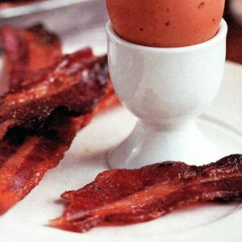
  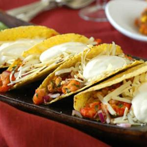
  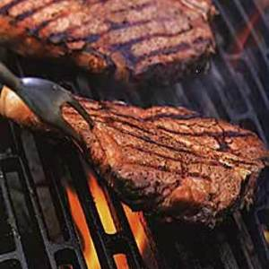
</p>

# Data Engineering

When training the models that return the closest recipe I ran into a problem. The training data is only one image for every recipe. In order to fix this we add create more images for the model to train on by rotating them.

<p align="center">
  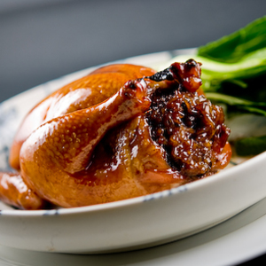
  
  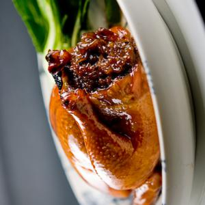
  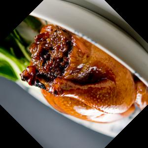
</p>
<p align="center">
  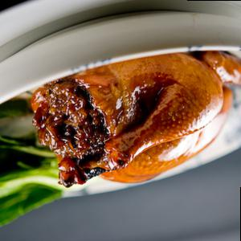
  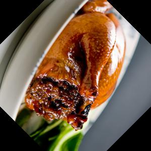
  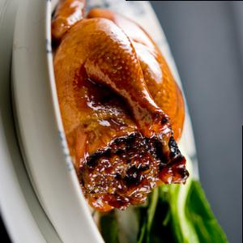
  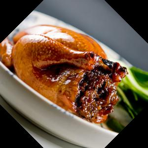
</p>


# Model Training

I originally went about training my models with evolution theory. After about three runs for 8 hours and an accuracy no greater then 25% I gave up and decided to hand make the models.

Unfortunately I was having the same amount of trouble trying to hand code them myself. The best model I made with this was 50%

Then thanks to a tip from another student I adapted an already pertained model from Keras. The model was a VGG16 for feature extracting. With these models I was able to close the gap for the one image recipe models.

#### Hotdog Model Score

```
Epoch 23/50
7/7 [==============================] - 42s - loss: 0.0814 - acc: 0.9711 - val_loss: 0.1888 - val_acc: 0.9474
Epoch 24/50
7/7 [==============================] - 42s - loss: 0.2246 - acc: 0.9520 - val_loss: 0.2706 - val_acc: 0.9211

[0.27062602850951645, 0.92105263157894735]
```

#### Tacos Model Score

```
Epoch 23/50
7/7 [==============================] - 42s - loss: 0.1875 - acc: 0.9519 - val_loss: 1.1162 - val_acc: 0.7368
Epoch 44/50
7/7 [==============================] - 42s - loss: 1.0346 - acc: 0.7789 - val_loss: 1.3075 - val_acc: 0.7105
38/38 [==============================] - 2s
[1.3075031049941714, 0.71052631578947367]
```


# Web app

I built a Bootstap/Flask web app that allows you to enter an image and have the models predict and return micro nutrients for the given prediction.The first model predicts which category the image belongs too. Then another model returns the closest matching recipe image.With these two points of data we grab the nutrients from the mongo database and return them for the user.

### Link to the Web app
https://dsi-seefood.herokuapp.com

<br />
#### Predicting framework


<iframe frameborder="0" style="width:100%;height:700px;" src="https://www.draw.io/?lightbox=1&highlight=0000ff&edit=_blank&layers=1&nav=1&title=Untitled%20Diagram.xml#R5Vpdk5s2FP01ftyOkSzAj7Gzm3amme7MZqbNowzXoCxGFERs76%2BvBAKMxaZJA1rb3Qcvuvq6nHt0dBHM8Hp3%2BJDTLP7IQ0hmaB4eZvj9DKElmctfZTjWBoJwbYhyFtYmpzM8sRfQRt0vKlkIRa%2Bh4DwRLOsbA56mEIiejeY53%2FebbXnSnzWjERiGp4AmpvVPFoq4tvrNbSn7r8CiuJnZmeuaDQ2eo5yXqZ5vhvC2%2Bqurd7QZS7cvYhry%2FYkJ38%2FwOudc1Fe7wxoSBW0DW93v4ZXa1u8cUvE9HbD24ytNSmhcrhwTxwYM6WOmLgsB2Qyv9jET8JTRQNn2MvzSFotdIkuOvCxEzp9hzROeV91x6C03Eh682rIkObFvt0GIfGmPchoy6W%2BvjpKqj%2FYOcgGHV2%2FRaYGTfAS%2BA5EfZZOmg6fvUXMRNVHcd5EljS0%2BjWoDDtVsitqxO0TlhQZ1GOCFASeEkmq6yHMR84inNLnvrKuKP6AGmPexhQMTfynzL0SXPjc1qfTrpEoVP%2BsBvoAQR73GaCm4NHXz%2Fs55pseoPVXufRtpeTe8zAPdSvNF0DwC3QoPxyOHhAr2tT%2F6z2CLDO7%2BlmaleJXAQpIVXrjq%2FsMs3vhkQYZY7AcQBOMwFRO%2Fz1STqA4mJlHH4Kk%2FDU%2FROVGnJSM2yUgskXF56wt9AFvXErZNWjA2uN5Fo%2BtZQhcbMrqmAiJezaZTuzP0O2yd%2F6ClbuDDZmtqaUjB346lpS7paak%2FoKVoYNN3R9BSZ6JN3xDTE7oiy3wlJl8dW%2Fu%2BQ%2BxorQUEfwIt3fWRMzlJy%2FuW6McmNzgjdB0x3esM89aN7wuDa1%2BVvQug%2BSvCMzrNiaHLn2jAi4lE2Ucb7LoDokzADxfjiHKb0WpyOjZVudnnblmV3QG6%2BpboOtWj7iXJwRC%2BS1v4Wtr13i4HHkLXVhLsGmL7yF5e6BWL7XkGbFds%2Fwe5gWfSFSFbYjDRec3liMEQurYyr6kOcy4pVRjCd24JX88Q2ycB9PmKxZY4b5jZOo6B5zpmwTOkIyO5dD1MB5AER2LpTfOM0CL0b0iOcQruIAPJB1bENwAjnrsWYTSPFFcA21uAceDl4XQwmjr5CFkGOU%2FZDLl0pxBKN0XW3utVYatE%2Be1Wuj%2BgmQAF3ACQdtf60tzMaVmoDyxuAEmby70Z9%2FTA727F02sE8jwfsrq2kZkPPbAE1Cn5Rxal%2FBrTonNAra5xZKZFn3J2J1h2C0jaXOPYpKbcyROhbplX73E6LN2%2FS95U3BXVc%2BA72QAtskNXKa8i9f%2BPUlSfvtRjSTfq4epKI0oSPfGtUKRKdfpR0CaayBUki4FEG6R9pWLBApq80xU7FobV8%2FBQ7EcIn0vOFwIxwrcYiB768ejJYvclXv2CrPvaEd%2F%2FAw%3D%3D"></iframe>


# API

I worked with the web-dev team to build them an API to return the micro nutrient counts for and image they provided.

It works with a standard get method taking the link of an image. The app then downloads, crops, and resizes the images. The new scaled image is then run through the models and returns the micro-nutrients in a json format.

# Evolution Theory

I started with 100 randomly generated models and went through 100 generations.

Here when the models didn’t correctly identify the food they became sick and died.
Not before they reproduced though.

So when the models reproduce they randomly switch there DNA sequence between the mates making a new model.

There is also random mutation involved in the DNA copy sequence.

Image of Family tree:
<p align="center">
  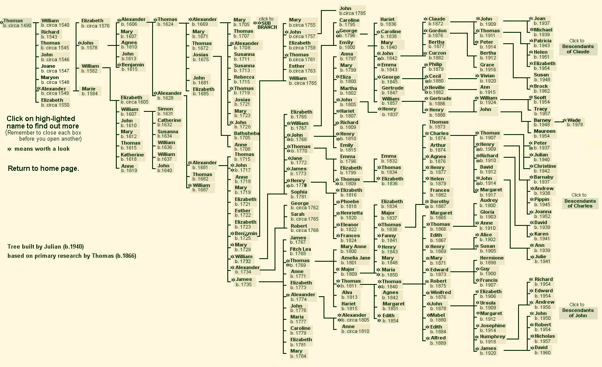

</p>


# Results
The final product is 11 Convolutional Neural Nets.

The main overall model that predicts the 1 out of 10 classes trained on 300 images with an accuracy of %.

After the first model it goes into the individual class models which return the closest related image trained on 30 classes of one image rotated 8 times to make a dataset of 240 images. with the accuracies ranging from 73% to 95%

### Problems

The biggest problem the data set that I had created. The problem is I have no true test images to try on my models that havent been seen. So the data leakage is high in my training. If I were able to get multiple images for the same recipe then this problem wouldn’t be so bad.

### Whats Next?

To increase classes from ten to include many other recipes like drinks and deserts. The data set I have is very small compared to what it could be.


#### References:

Project:
http://dl.acm.org/citation.cfm?id=2654970

Evolution Theory:
https://arxiv.org/abs/1703.01041
