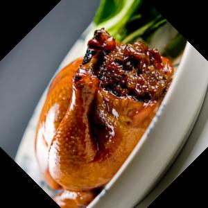
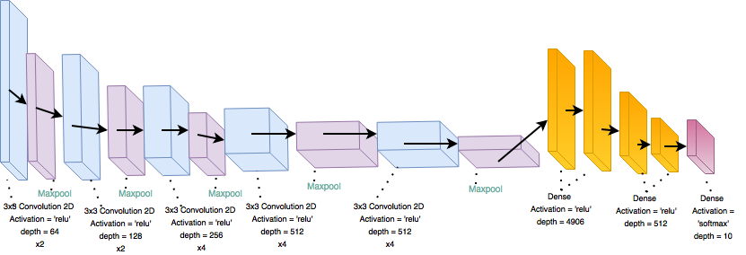

# SeeFood

Evolving the idea from Silicon valley of an image recognizer that will return micro nutrient counts for food logging. When I get into my workout kicks I always try to track my calorie intake vs calories burned. Most of the apps I used to log my calories made you enter each part of the meal by hand. During a busy day I would forget to add the meal trying to think back on it later in the day. This would always lead to the logging being incorrect. I attempted to fix this problem with DSI-SeeFood. Using a image of a plate of food I attempted to return the micro nutrients of the closest related image.


# Data

While researching on how to go about building the application I came across an API from a website called:
http://food2fork.com

The data from http://food2fork.com had an image of a given recipe along with its micro-nuritents. The api also called for a keyword for the recipes which became the “category”.

I then built a mongo database of the image URL and the micro-nutrient counts along with the “category” and “index” for later recall when the CNNs give there prediction.

#### An Example Response of the API:

```
  "name": "Uncle Ray's Crawfish Tacos", "image_url": "https://www.edamam.com/web-img/b6d/b6da6e61ae1e9e4c6d0dec0a06b2e0c5.jpg", "calories": 3777.3231101292263, "totalNutrients": { "ENERC_KCAL": { "label": "Energy", "quantity": 3777.3231101292263, "unit": "kcal" }, "FAT": { "label": "Fat", "quantity": 294.4100541766353, "unit": "g" }, "FASAT": { "label": "Saturated", "quantity": 115.27750486814912, "unit": "g" }, "FATRN": { "label": "Trans", "quantity": 3.604879048194885, "unit": "g" }, "FAMS": { "label": "Monounsaturated", "quantity": 130.17326769163503, "unit": "g" }, "FAPU": { "label": "Polyunsaturated", "quantity": 22.17917192474904, "unit": "g" }, "CHOCDF": { "label": "Carbs", "quantity": 82.93138786965841, "unit": "g" }, "FIBTG": { "label": "Fiber", "quantity": 27.028811426874757, "unit": "g" }, "SUGAR": { "label": "Sugars", "quantity": 32.48175626122265, "unit": "g" }, "PROCNT": { "label": "Protein", "quantity": 217.05912140846726, "unit": "g" }, "CHOLE": { "label": "Cholesterol", "quantity": 1505.9827301979064, "unit": "mg" }, "NA": { "label": "Sodium", "quantity": 4425.2672222572855, "unit": "mg" }, "CA": { "label": "Calcium", "quantity": 2645.8104272238634, "unit": "mg" }, "MG": { "label": "Magnesium", "quantity": 550.9793977346346, "unit": "mg" }, "K": { "label": "Potassium", "quantity": 4515.394603613797, "unit": "mg" }, "FE": { "label": "Iron", "quantity": 19.494643457930632, "unit": "mg" }, "ZN": { "label": "Zinc", "quantity": 23.953853427761885, "unit": "mg" }, "P": { "label": "Phosphorus", "quantity": 4102.917357457969, "unit": "mg" }, "VITA_RAE": { "label": "Vitamin A", "quantity": 1563.6353102594699, "unit": "µg" }, "VITC": { "label": "Vitamin C", "quantity": 55.95560162973405, "unit": "mg" }, "THIA": { "label": "Thiamin (B1)", "quantity": 1.0617380517936088, "unit": "mg" }, "RIBF": { "label": "Riboflavin (B2)", "quantity": 2.1095807390074492, "unit": "mg" }, "NIA": { "label": "Niacin (B3)", "quantity": 22.070284788691357, "unit": "mg" }, "VITB6A": { "label": "Vitamin B6", "quantity": 1.722504711193002, "unit": "mg" }, "FOLDFE": { "label": "Folate (Equivalent)", "quantity": 449.028968314048, "unit": "µg" }, "VITB12": { "label": "Vitamin B12", "quantity": 21.153781525230407, "unit": "µg" }, "VITD": { "label": "Vitamin D", "quantity": 3.1667771244049074, "unit": "µg" }, "TOCPHA": { "label": "Vitamin E", "quantity": 45.70922011611537, "unit": "mg" }, "VITK1": { "label": "Vitamin K", "quantity": 91.54439890533888, "unit": "µg" } }}```

## Scraping the web

With the data I needed and the image URLs it was time to scrape the web. I made a script that went through all of the URLs in the Mongo database and scraped the images down. I then saved that image to an amazon S3 bucket.

#### Examples of images

<p align="center">
  
  
  
</p>

# Data Engineering

When training the models that return the closest recipe I ran into a problem. The training data is only one image for every recipe. In order to fix this we add create more images for the model to train on by rotating them.

<p align="center">
  
  
  
  
</p>
<p align="center">
  
  
  
  
</p>


# Approach

## Framework
I built my app framework around the database I created. That database was 1000 recipe images over 10 categories. I decided to go with a main neural network trained to recognize what category of food the images belonged too. Then a second model to trained to recognize the closest related recipe.

>Flowchart of the framework showing 3 categories.
<p align="center">
  
</p>


## Model Training

I originally went about training my models with `evolution theory`(below). After about three runs for 8 hours and an accuracy no greater than 25% I gave up and decided to hand make the models.

Unfortunately, I was having the same amount of trouble trying to hand code them myself. The best model I made with this was 50%.

Then thanks to a tip from another student I adapted an already pertained model from Keras. The model was a VGG16 for feature extracting.

## VGG16 pre-trained
Using the VGG16 pre-trained model along with an additional two dense layers the results started showing.

#### Hotdog Model Score

```
Epoch 23/50
7/7 [==============================] - 42s - loss: 0.0814 - acc: 0.9711 - val_loss: 0.1888 - val_acc: 0.9474
Epoch 24/50
7/7 [==============================] - 42s - loss: 0.2246 - acc: 0.9520 - val_loss: 0.2706 - val_acc: 0.9211

loss: 0.270, accuracy: 0.921
```

#### Tacos Model Score

```
Epoch 23/50
7/7 [==============================] - 42s - loss: 0.1875 - acc: 0.9519 - val_loss: 1.1162 - val_acc: 0.7368
Epoch 44/50
7/7 [==============================] - 42s - loss: 1.0346 - acc: 0.7789 - val_loss: 1.3075 - val_acc: 0.7105
38/38 [==============================] - 2s
loss: 1.30, accuracy 0.710
```

>VGG16 framework w/ additions.
<p align="center">
  
</p>

## VGG19 pre-trained
I went with a "bigger" pre-trained model for the category detection. The VGG19 is similar to the VGG16 but has a few additional convolutional 2D layers. Along with my addition of two more dense layers.

#### Main Model Score

```
Epoch 50/50
214/214 [==============================] - 761s - loss: 0.1016 - acc: 0.9593 - val_loss: 0.16 - val_acc: 0.92
Loss: 0.16 Accuracy: 0.927
```

>VGG19 framework w/ additions.
<p align="center">
  
</p>


## Evolution Theory

Some background on how my Evolution theory script works:
* It starts out making random convolutional
neural nets for a given population. e.g. the number or neurons, layers, and activation are all randomly generated.
* After the random models are made they are then trained and have a given accuracy tied to them
* The models “Reproduce” giving a random choice of their hyper-parameters to make offspring.
* The new models are then trained
* Then the models with the lowest accuracies
are “Killed off ”


# Web app

I built a Bootstap/Flask web app that allows you to enter an image and have the models predict. The web app then grabs the micronutrients from a mongo database are displays them. The app is up on an amazon ec2 instance.

### Link to the Web app
http://dsi-seefood.com:8111


## Web app API V1

I worked with the web-dev team to build them an API to return the micronutrient counts for an image they provided.

It works with a standard GET method taking the link of an image. The app then downloads crops and resizes the images. The new scaled image is then run through the models and returns the micro-nutrients in a JSON format.

## Web app API V1

I wanted to build a mobile app that makes a POST method of an image. So the second version is made to take image data instead of a link.


# Results
The final product is 11 Convolutional Neural Nets.

The main overall model that predicts the 1 out of 10 classes trained on 300 images with an accuracy of 92%.

The secondary models which return the closest related image, trained on 30 classes of one image rotated 8 times to make a dataset of 240 images. with the accuracies ranging from 42% to 97%.

### Problems

The biggest problem the data set that I had created. The problem is I have no true test images to try on my models that havent been seen. So the data leakage is high in my training. If I were able to get multiple images for the same recipe then this problem wouldn’t be so bad.

### Whats Next?

To increase classes from ten to include many other recipes like drinks and deserts. The data set I have is very small compared to what it could be.


#### References:

Project:
http://dl.acm.org/citation.cfm?id=2654970

Evolution Theory:
https://arxiv.org/abs/1703.01041
